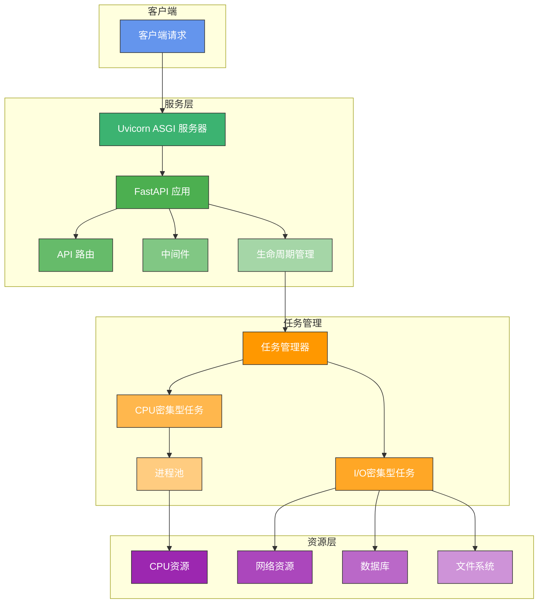
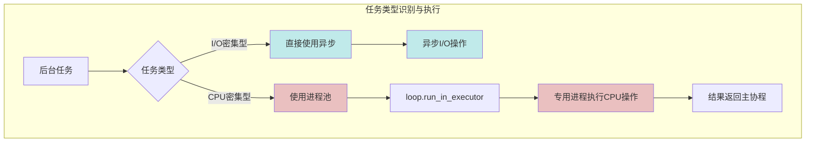
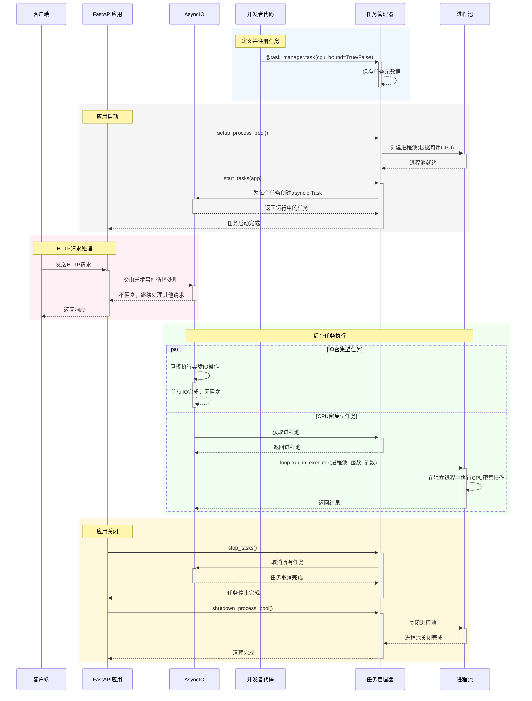

+++
title = '在 Async Python 中进行 CPU 密集型工作'
date = 2025-04-28T12:51:32+08:00
draft = false
+++

这篇算是书接上文 [Python Web 框架中的后台任务](/posts/background-tasks-in-python-web)，继续讨论在
Python 中如何处理 CPU 密集型工作。

<!--more-->

## 背景

我们组有个 python 服务，里面有一些机器学习的功能，例如人脸识别和 ocr 还有音频分析等。这些任务用到的通常都是阻塞性的 api。现在我是通过 twsited 将它们创建成单独的线程或进程。但是我更想结合最近实践到的 fastapi 和 lifespan 来管理。

但是 lifespan 启动后台任务比较适合做一些 io 密集的，如果是这种 cpu 肯定会阻塞住事件循环导致整个 fastapi 进程卡住，可以说是典型错误了。

那么进一步说，到底如何让 CPU 密集和 IO 密集的代码在 async 中协同工作呢？

## 解决方案

答案是使用 `asyncio.run_in_executor`.

这个方法可以将一些阻塞性任务卸载到其他线程或者其他进程(具体取决于你传入的 executor)，返回值包装为一个 Future 所以你就可以把它无缝组合到自己的 async 代码中了！

我打算在 lifespan 中使用 `asyncio.create_task` 创建一系列 tasks 然后在 tasks 中涉及到 CPU 密集方法时使用 `asyncio.run_in_executor` 执行，这样可以保证主服务 fastapi 不受到影响。同时，我们可以对 executor 进行 `max_worker` 限制，通过一些手段感知容器或物理机中的 cpu 数量，这样 CPU 密集的任务可以充分地利用到多核。

> 对于 Gopher 来说，可以把 `asyncio.create_task` 当成是 `go func(){}()`, 它的作用是创建一个
> Futures 对象并立即执行，然后注册到事件循环中。该方法会返回一个 task 对象。你可以通过 `await
> task` 来等他它执行完成，也可以抛之脑后让它自己在事件循环中执行。

为此我设计了一套新的架构。

### 架构概览

新架构基于 AsyncIO 生态系统，采用 FastAPI 作为 Web 框架，Uvicorn 作为 ASGI 服务器，并引入后台任务管理器。主进程(web)全部使用协程并发，几乎没有切换成本。对于 CPU 密集函数则卸载到多进程，可以充分使用并行。



### I/O 与 CPU 密集任务衔接设计

设计了一个统一的任务管理系统，它首先在容器环境中识别可用的 CPU 资源，使用
`concurrent.futures.ProcessPoolExecutor` 创建一个进程池。

在编写任务时可以使用 `@task` 装饰器来标记任务类型。对于 I/O 密集型任务，直接使用异步函数；对于 CPU 密集型任务，则使用 `asyncio.run_in_executor` 在进程池中执行。



### 后台任务管理框架

设计一个装饰器驱动的背景任务管理系统，能够通过简单的装饰器定义和管理新增后台任务。

用法演示: 创建新的后台任务只需要创建一个新的 py 文件，编写函数，引用装饰器即可。

loop.run_in_executor 可以将CPU密集的阻塞性代码放入一个预先定义容量的进程池执行，通过事件循环回调，对外暴露为一个异步等待的 Future。不影响其他异步代码的并发执行。

当进程池用满时，Future 会自动挂起等待空闲进程，不会无节制创建新进程。

这样就可以实现 CPU 密集和 IO 密集任务在同一个函数中混合使用。

```python
from your_app.background import task_manager

@task_manager.task(name="data_sync", cpu_bound=False)
async def sync_data_task():
    """I/O密集型数据同步任务"""
    while True:
        try:
            # 异步I/O操作
            await asyncio.sleep(300)  # 每5分钟执行一次
        except asyncio.CancelledError:
            break

@task_manager.task(name="image_processor", cpu_bound=True)
async def process_images_task():
    """CPU密集型图像处理任务"""
    while True:
        try:
            # 获取需要处理的图像
            images = await get_pending_images()
            
            # 对每个图像使用进程池处理
            loop = asyncio.get_running_loop()
            for image in images:
                result = await loop.run_in_executor(
                    task_manager.get_process_pool(),
                    process_image_data,  # CPU密集型函数
                    image.data
                )
                await save_result(image.id, result)
                
            await asyncio.sleep(60)
        except asyncio.CancelledError:
            break
```
### 任务管理器核心实现

这里给出的是初版的代码实现，实际上在工作里用的已经不是这样。但不妨碍我们理解这个设计思路。

```python
import os
import asyncio
import inspect
import logging
from typing import List, Dict, Any, Optional
from multiprocessing import cpu_count
from concurrent.futures import ProcessPoolExecutor
from fastapi import FastAPI

class BackgroundTaskManager:
    """背景任务管理器 - 使用装饰器注册和管理后台任务"""
    
    def __init__(self):
        self.tasks: List[Dict[str, Any]] = []
        self.running_tasks: List[asyncio.Task] = []
        self.process_pool: Optional[ProcessPoolExecutor] = None
    
    def task(self, *, name: Optional[str] = None, cpu_bound: bool = False,
             startup: bool = True, shutdown_timeout: float = 10.0):
        """
        装饰器: 注册一个后台任务
        
        参数:
            name: 任务名称 (默认使用函数名)
            cpu_bound: 是否是CPU密集型任务
            startup: 是否在应用启动时自动启动任务
            shutdown_timeout: 关闭时等待任务完成的超时时间(秒)
        """
        def decorator(func):
            if not asyncio.iscoroutinefunction(func):
                raise ValueError(f"Background task {func.__name__} must be an async function")
            
            task_name = name or func.__name__
            
            # 存储任务信息
            self.tasks.append({
                "name": task_name,
                "function": func,
                "cpu_bound": cpu_bound,
                "startup": startup,
                "shutdown_timeout": shutdown_timeout
            })
            
            # 返回原始函数不变
            return func
            
        return decorator
    
    def setup_process_pool(self):
        """设置进程池 - 用于CPU密集型任务"""
        if any(task["cpu_bound"] for task in self.tasks):
            cpus = get_cpu_limit()
            workers = max(1, cpus - 1)  # 保留一个CPU给事件循环
            self.process_pool = ProcessPoolExecutor(max_workers=workers)
            logging.info(f"Process pool created with {workers} workers (detected {cpus} CPUs)")
    
    async def start_tasks(self, app: FastAPI):
        """启动所有注册的任务"""
        for task_info in self.tasks:
            if task_info["startup"]:
                name = task_info["name"]
                func = task_info["function"]
                
                # 检查函数签名，如果函数接受app参数，则传入
                sig = inspect.signature(func)
                if "app" in sig.parameters:
                    task_coroutine = func(app)
                else:
                    task_coroutine = func()
                
                # 创建并保存任务
                asyncio_task = asyncio.create_task(task_coroutine, name=name)
                self.running_tasks.append(asyncio_task)
                logging.info(f"Started background task: {name}")
    
    async def stop_tasks(self):
        """停止所有运行中的任务"""
        if not self.running_tasks:
            return
            
        # 取消所有任务
        for task in self.running_tasks:
            if not task.done():
                task.cancel()
        
        # 等待所有任务完成或超时
        pending = self.running_tasks
        self.running_tasks = []
        
        if pending:
            done, pending = await asyncio.wait(
                pending, 
                timeout=10.0,
                return_when=asyncio.ALL_COMPLETED
            )
            
            # 记录未完成的任务
            if pending:
                task_names = [task.get_name() for task in pending]
                logging.warning(f"Some background tasks did not complete in time: {task_names}")
    
    def shutdown_process_pool(self):
        """关闭进程池"""
        if self.process_pool:
            self.process_pool.shutdown(wait=True)
            self.process_pool = None
            logging.info("Process pool shut down")
    
    def get_process_pool(self):
        """获取进程池 - 用于CPU密集型任务"""
        return self.process_pool
```

### CPU 资源识别

为了最大化利用多核资源，同时避免资源争用，我们实现了一个动态识别可用 CPU 资源的方法，尤其适用于容器环境：

```python
def get_cpu_limit():
    """获取容器环境或物理机中可用的CPU数量"""
    try:
        # 检查cgroups v1
        if os.path.exists("/sys/fs/cgroup/cpu/cpu.cfs_quota_us"):
            with open("/sys/fs/cgroup/cpu/cpu.cfs_quota_us") as fp:
                cfs_quota_us = int(fp.read().strip())
            if cfs_quota_us > 0:
                with open("/sys/fs/cgroup/cpu/cpu.cfs_period_us") as fp:
                    cfs_period_us = int(fp.read().strip())
                container_cpus = cfs_quota_us // cfs_period_us
                return container_cpus
        
        # 检查cgroups v2
        elif os.path.exists("/sys/fs/cgroup/cpu.max"):
            with open("/sys/fs/cgroup/cpu.max") as fp:
                content = fp.read().strip().split()
                if content[0] != "max":
                    quota = int(content[0])
                    period = int(content[1])
                    container_cpus = quota // period
                    return container_cpus
    
    except Exception as e:
        logging.warning(f"Error detecting container CPU limit: {e}")
    
    # 回退到系统CPU计数
    return cpu_count()
```

### 应用生命周期管理

通过 FastAPI 的 lifespan 上下文管理器，确保所有后台任务和资源的正确初始化与清理：

lifspan 函数是一个生成器函数，通过 yield 可以暂停执行。

利用这个特性，fastapi 可以实现生命周期 hook。

也就是：在 yield 之前的代码，在 fastapi 启动前执行，yield 之后的代码，在 fastapi 关闭前执行

这样我们也可以实现服务注册和服务销毁、加载配置中心配置和异步刷新配置等操作。

```python
@asynccontextmanager
async def lifespan(app: FastAPI):
    """应用生命周期管理"""
    # 设置进程池
    task_manager.setup_process_pool()
    
    # 将进程池添加到应用状态
    app.state.process_pool = task_manager.get_process_pool()
    
    # 启动所有注册的后台任务
    await task_manager.start_tasks(app)
    
    # 其他初始化...
    
    yield
    
    # 停止所有后台任务
    await task_manager.stop_tasks()
    
    # 关闭进程池
    task_manager.shutdown_process_pool()
    
    # 其他清理...

app = FastAPI(lifespan=lifespan)
```

### 工作流程

新架构的完整工作流程如下图所示：



### 性能预期

与当前架构相比，新架构会带来以下性能提升：

- 并发处理能力: IO 密集型请求不再受到线程、进程数限制，理论上只有内存大小和系统文件句柄数(65535)是它的处理能力上限
- CPU 密集任务吞吐量: 动态可调整并行，单 POD CPU 核心数越多并行处理能力越高，多种 CPU 密集任务可以交替地充分利用所有核心
- 服务响应速度: CPU 密集型操作也可以通过 HTTP API 提供服务，繁重计算任务卸载到其他核心，处理过程中不阻塞 web 服务处理其他响应。

## 总结

重构为基于 AsyncIO + FastAPI + Uvicorn 的架构，并实现专用的后台任务管理框架，将显著解决我们当前面临的主要问题：

1. 解决 I/O 密集和 CPU 密集任务衔接问题：通过自动区分任务类型并采用相应的执行策略，使应用保持高响应性
2. 更好地利用多核心资源：通过智能的 CPU 资源检测和进程池管理，最大化利用可用计算资源
3. 优化后台任务管理：提供统一的装饰器驱动任务注册机制，简化代码并确保任务生命周期得到正确管理

