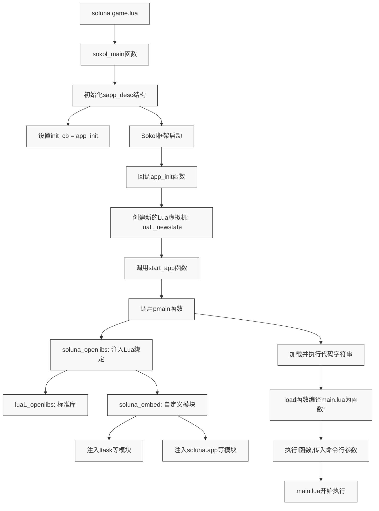
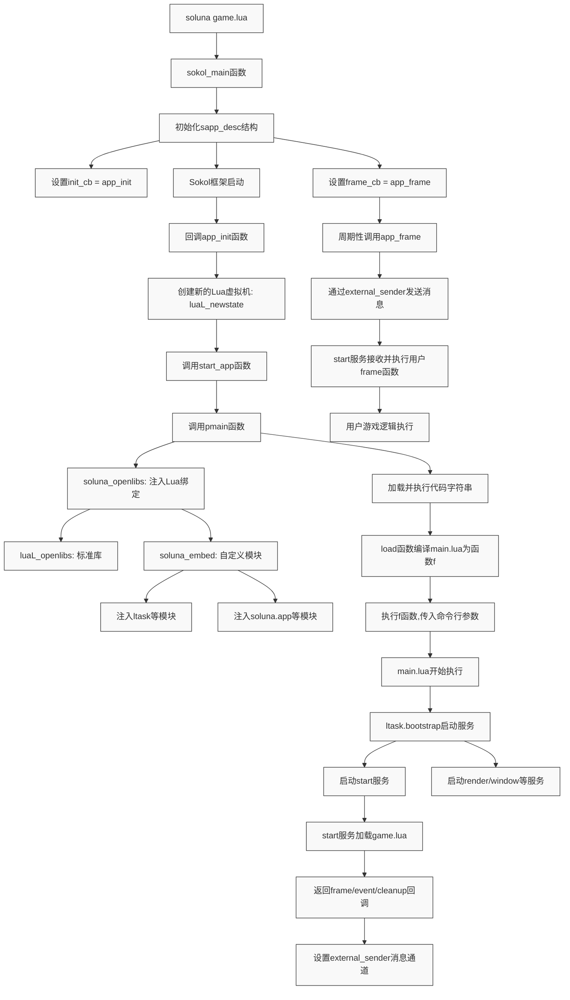
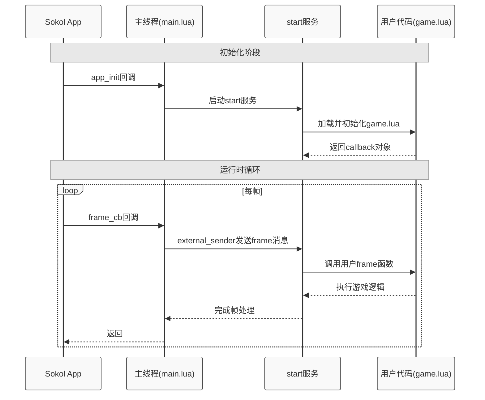

+++
title = 'ltask 使用方式研究 -- soluna 篇'
date = 2025-08-30T22:04:00+08:00
draft = false
+++
最近下定决心理解云风的 ltask 的设计和源码，因此我编写了一个 ltask-go 的库。

<!--more-->

事实证明，重新实现一遍 ltask ，尤其是用不同的语言来迫使自己思考，确实可以加速对 ltask 的理解。并且，我认为这个方法也可以扩展到其他项目上。当然，前提是项目不复杂，幸运的是，ltask 就是一个小巧的库。

对于 ltask 的设计的解析，我打算后面单独写一篇文章来记录，现在提不起兴趣(因为已经学会了)。我感到困惑的是，虽然 ltask-go 我几乎写完了并摆在那里，但是如何基于 ltask 编写一个提供给终端用户的框架我还是没有头绪。

在我所知的范围内，ltask 较大的应用是简悦的 ant 游戏框架。但是这个框架体量对我来说已经过于复杂了。

我花了好几天的时间，才稍微搞懂项目结构，编译方式等等，但此项目对我来说依然笼罩着迷雾。

最近，云风为了编写自己的小游戏 deep future, 又基于 ltask 写了个 soluna 游戏框架。此框架相对来说就小巧多了，可以说是相当迷你，稍微看了一眼，很好理解，并且可以完美地解答我对 ltask 使用的疑惑。

因此有了这篇文章，试图通过 soluna 的源码来理解如何基于 ltask 开发框架。

需要注意的是，本篇文章并不是严肃向解读 soluna 的源码。因为这个框架刚刚诞生，还不稳定，随时可能因为云风的需求而发生改变，因此写一篇源码解析没有太大价值。对我来说，重要的是它对 ltask 的使用方式。

> 声明: 我并不想跟读者讨论重写有什么意义，或者学习游戏开发为什么不从 UE 
> 等其他成熟引擎开始。做感兴趣的事情不需要任何理由。

## 启动与疑惑

据我理解，ltask 一共分为三块，分别是 `ltask.bootstrp`, `ltask`, `ltask.root`。常规使用方式就是先定义一个启动脚本，例如 `bootstrap.lua` 然后在这个脚本中调用 bootstrap 模块，进行启动引导。

```lua
local boot = require("ltask.bootstrap")
local function searchpath(name) return assert(boot.searchpath(name, "lualib/?.lua")) end
local function start(config)
  local servicepath = searchpath("service")
  local root_config = {
    bootstrap = config.bootstrap,
    -- 省略一些配置
    initfunc = ([=[
-- 服务初始化函数
]=]):gsub("%$%{([^}]*)%}", {
      lua_path = package.path,
      lua_cpath = package.cpath,
      service_path = config.service_path,
    }),
  }
  local bootstrap = load(searchpath("bootstrap"))()
  local ctx = bootstrap.start({
    -- 省略一些启动配置
  })
  bootstrap.wait(ctx)
end
start({
  service_path = "service/?.lua;src/?.lua",
  bootstrap = {
    -- 省略一些内置服务
    {
      name = "start",
    },
  },
})
```

启动的过程中，我们需要指定要启动的一些 services(例如上面的 start 和一些内置服务)。每个 service 就是一个 lua 虚拟机。虽然 services 是由用户编写的，但并不是毫无章程地乱写。用户编写时，一般需要创建一个 table，并为这个 table 实现一系列函数方法，然后将 table 返回。

```lua
local S = {}
function S.aaa() return 'hi aaa' end
function S.bbb(name) return 'hi ' .. name end 
return S
```

在 ltask 中，内置了两个 lua 胶水模块，分别是 luaib 和 service 。其中 service 是一些内置的服务，例如 root 服务，timer 服务和 log 服务。这些是题外话按下不表(因此，我们也不会涉及到 `ltask.root`)。在 lualib 中，定义了一个 `service.lua` 脚本，它——便是所有用户编写的 services 的模板，或者说脚手架。

用户在 bootstrap 过程中所指定要启动的服务，都会由 root 去对应的目录下寻找`服务名.lua`脚本，然后以字符串的形式载入成一段 lua 可执行代码。每个 lua 虚拟机被启动之后，就会载入 service 模板，进行一系列自启动准备，接着执行用户编写的这段代码，在执行后返回的 table，其各方法将会作为路由方法 patch 到虚拟机的主循环中。由于每个虚拟机都以 request/response 的形式进行响应，因此不同虚拟机之间可以通过消息请求进行通讯。在通讯时可以指定刚才编写的方法名进行对应的函数调用。例如

```lua
local addr = ltask.queryservice('service_1')
local res = ltask.call(addr, 'aaa')
print(res) -- hi aaa
res = ltask.call(addr, 'bbb', 'yuchanns')
print(res) -- hi yuchanns
```

以上，是从 ltask 使用者的视角去看 ltask 如何使用的。

但，正如仓库所说，ltask 只是一个基础库，使用者还要基于该库封装更上层的框架，然后才需要给到终端用户。终端用户是不关心运行时的原理的，他们在编写业务代码时，应该不需要考虑 ltask 启动了哪些服务，甚至不需要知道有几个服务，有什么线程在运行，完全不需要跟 ltask 打交道。

那么我就很好奇，到底是什么样的封装，才能让用户完全无感知呢？

更进一步的，当我查看 soluna 的应用案例，也就是 deepfuture 时，我的疑惑更加深了：它的代码中，仅仅是调用 soluna 的一些模块，看起来似乎完全是串行的写法，其中并没有 ltask 的痕迹，也没有前面我们所说“有意识”地编写多个 service 去参与其中，整个程序就以多线程的形式启动了，这背后到底进行了怎样的封装呢？

```lua
local soluna = requre("soluna")
local callback = {}

soluna.set_window_title('title')

return callback
```

而当我去看 soluna 的源码时，对于整个程序到底从哪里开始运行、怎么进入到 lua 、在这过程中 ltask 又如何参与进去，也完全不了解。

这样说出来可能令人发笑，虽然我具有丰富的编程经历，但在游戏和 lua 编程这方面我是完全的初学者，毫无经验。

## 切入点-启动

在困惑了一阵后，我想到，虽然我不知道 soluna 的运行逻辑，但是我知道 ltask 如何使用呀！想要知道 ltask 是如何介入其中，我可以先搜索它的启动位置，然后反推出前后流程。

所以切入点就是——`ltask.bootstrap`。

很快，通过全局搜索我定位到了该库的位置，就在 soluna 源码的 `src/lualib/main.lua`。到这里似乎熟悉了一点，因为 soluna 的源码目录结构(`src`)就如同 ltask 自身那样，是一些 c 代码，lualib 和 service 组成的。这里我们可以很快推测出来，soluna 在启动时，就已经确定启动哪些 service ，而用户编写游戏业务的脚本，只是调用了 soluna 封装的一些背后是 ltask.call 函数，所以没有感知。我们可以快速浏览一下提供了哪些 service:

```bash
gamepad.lua
loader.lua
render.lua
start.lua
window.lua
```

可见，游戏控制、素材载入、渲染和视窗都是单独的线程在处理。

疑惑稍稍得到了缓解，用户虽然仅仅调用了 soluna 的模块，但内部透传到了对 ltask 的操作上。

那么接下来的疑问就是：

1. 这个 main.lua 是怎么启动的呢？
2. ltask 模块是怎么注入到 main.lua 中？
3. 用户编写的游戏脚本又在其中的什么位置呢？

又是通过万能的全局搜索(没错，对于跨语言交互和c项目源码，全局搜索才是最快最好的工具，什么代码导航都派不上用场)，我们可以发现在 `src/entry.c`中有这么一段代码

```c
static const char *code = "local embed = require 'soluna.embedsource' ; local f = load(embed.runtime.main()) ; return f(...)";
```

这段代码指示了通过一个 embedsource 模块读取了 main.lua 的内容，转换成可执行的函数 f ，并且执行后返回。这里 embedsource 是什么此时我们不需要关心(虽然我确实地研究了其实现)，只需要知道它就是使用了 `load`读取和执行脚本就对了。

那么什么地方读取了这个 `code` 呢？这次我们很快就可以在稍稍下方找到一个 `pmain`函数，引用了这里。

```c
static int
pmain(lua_State *L) {
	soluna_openlibs(L);
	// 省略一些 sokol 代码, 主要是将命令行的参数传递插入到 lua 栈中
	if (luaL_loadstring(L, code) != LUA_OK) {
		return lua_error(L);
	}
	lua_insert(L, -arg_n-1);
	lua_call(L, arg_n, 1);
	return 1;
}
```

该函数载入了上述的 code，然后插入一些从 sokol\_app 传递过来的参数，作为调用该 code 的入参，也就是我们看到的 `f(...)`。这样从最终结果上来说，当执行 `soluna game.lua`时，game.lua 这个参数就会传递给函数 f。

按理说，接下来我们只需要看一下 pmain 被谁调用就可以往上寻找启动的流程了。不过这里还有一个函数吸引了我的注意，那就是`soluna_openlibs`。很显然，这就是 soluna 对虚拟机注入 binding 的入口了。

马上我们继续用全局搜索，看到了函数的定义(在 `openlibs.c`):

```c
void
soluna_openlibs(lua_State *L) {
    luaL_openlibs(L);
    soluna_embed(L);
}
```

又是一个需要全局搜的函数签名 `soluna_embed`(在 `luamods.c`):

```c
void soluna_embed(lua_State* L) {
    static const luaL_Reg modules[] = {
		{ "ltask", luaopen_ltask},
		{ "ltask.root", luaopen_ltask_root},
		{ "ltask.bootstrap", luaopen_ltask_bootstrap},
		{ "soluna.app", luaopen_soluna_app },
		// ...各种 soluna lua binding
		{ NULL, NULL },
    };

    const luaL_Reg *lib;
    luaL_getsubtable(L, LUA_REGISTRYINDEX, LUA_PRELOAD_TABLE);
    for (lib = modules; lib->func; lib++) {
        lua_pushcfunction(L, lib->func);
        lua_setfield(L, -2, lib->name);
    }
    lua_pop(L, 1);
}
```

这下情况变得明朗，所有的 lua binding, 包括 ltask 都是通过这里注入到启动的虚拟机中的。第二个问题解决。

继续往上查找，看看 pmain 是怎么被调用的。回到 `entry.c` 我们可以看到 pmain 是被 start\_app 这个函数所调用的，而后者则是在 app\_init 函数被调用的。最终我们看到 app\_init 注册到了 sokol\_main 返回的 sapp\_desc 的 init\_cb 上。

```c
static int
start_app(lua_State *L) {
	lua_settop(L, 0);
	lua_pushcfunction(L, msghandler);
	lua_pushcfunction(L, pmain);
	if (lua_pcall(L, 0, 1, 1) != LUA_OK) {
		fprintf(stderr, "Start fatal : %s", lua_tostring(L, -1));
		return 1;
	} else {
		return init_callback(L, CTX);
	}
}

static void
app_init() {
        // 开头省略
	lua_State *L = luaL_newstate();
	// 中间省略
	if (start_app(L)) {
		// 省略失败处理
	} else {
		// 省略成功处理
	}
}

sapp_desc
sokol_main(int argc, char* argv[]) {
	// 前面省略
        sapp_desc d;
        // 中间省略
	d.init_cb = app_init;
        // 后面省略
	return d;
}
```

## 小结-启动流程

现在我们终于可以总结一下：当框架用户使用 soluna 时，例如执行 `soluna game.lua`命令后，程序首先会执行 sokol 定义的 main 函数，在做好一些前置准备后，sokol 开始回调 app\_init 函数，创建第一个 lua 实例，并且对 lua 虚拟机注入 binding (start\_app), 然后加载 `main.lua`脚本。至此，就实现执行权从 c 部分到 lua 部分的切换。



现在，我们可以来回答前两个问题：

1. main.lua 是在 sokol\_app 启动过程中创建的第一个 lua 虚拟机读取执行的
2. 在执行 main.lua 前，先注入了包括 ltask 在内的各种 lua binding 模块

最后一个问题：用户编写的脚本，也就是 `game.lua`的定位在哪里？这就要深入了解 main.lua 的内容了。

```lua
local function start(config)
	-- 省略开头
        -- 这里插入了一个 start 服务
	table.insert(root_config.bootstrap, {
		name = "start",
		args = {
			config.args,
			-- 省略其他参数
		},
	})
	boot.init_socket()
	local bootstrap = load(embedsource.runtime.bootstrap(), "@3rd/ltask/lualib/bootstrap.lua")()
	-- 省略中间
	local ctx = bootstrap.start {
		-- 省略启动参数
	}
	-- 省略结尾
	local sender, sender_ud = bootstrap.external_sender(ctx)
	local c_sendmessage = require "soluna.app".sendmessage
	local function send_message(...)
		c_sendmessage(sender, sender_ud, ...)
	end
	return {
		-- 省略其他参数
		cleanup = function()
			send_message "cleanup"
			bootstrap.wait(ctx)
		end,
		frame = function(count)
			send_message("frame", count)
			frame_barrier:wait()
		end,
		event = function(ev)
			send_message(unpackevent(ev))
		end,
	}
end
local args = ... or {}
-- 省略对 args 的处理
return start {
	args = args,
	core = {
		debuglog = "=", -- stdout
	},
	bootstrap = {
		-- 省略其他启动服务
		{
			name = "loader",
			unique = true,
		},
    },
}
```

这里对于将 ltask RIIG (Rewrite It In Go) 的我来说就变得非常易懂：一个典型的 ltask 启动过程，除了指定一些独占服务外，还在插入了一个 start 服务，也就是 `src/service/start.lua`脚本。可以注意到，最终命令行参数是传给了它(也就是 `soluna game.lua`中 `game.lua`)。

注意这里 `external_sender`包装成的 send\_message，后面会用到（这部分 ltask-go 甚至还没实现呢！这下知道用途是什么了）。

在最后， main.lua 返回了一个对象，包含了 cleanup, frame 和 event 三个函数。

&#x20;所以我们接下来把目光移动到 `start.lua`。

## 真正的开始

```lua
-- 省略
local args, ev = ...
-- 省略
local S = {}
-- 省略
local app = {}
function S.external(p)
	local what, arg1, arg2 = message_unpack(p)
        -- 省略
	local f = app[what]
	if f then
		f(arg1, arg2)
	end
end
local function init(arg)
	-- 省略一些初始化过程
	local settings = ltask.uniqueservice "settings"
	ltask.call(settings, "init", arg)
        -- 省略一些初始化过程
	local setting = soluna.settings()
	local entry = setting.entry
	local source = entry and file.load(entry)
	if not source then
		error ("Can't load entry " .. tostring(entry))
	end
	local f = assert(load(source, "@"..entry, "t"))
	local function init_render()
		local callback = f {
			batch = batch,
			width = arg.app.width,
			height = arg.app.height,
			table.unpack(arg),
		}
		local frame_cb = callback.frame
		-- 省略一些初始化过程
		local function frame(count)
			-- 省略
			frame_cb(count)
			-- 省略
		end
		function app.frame(count)
			local ok, err = xpcall(frame, traceback, count)
			-- 省略
		end
	end
	function app.frame(count)
		local ok, err = xpcall(init_render, debug.traceback)
		-- 省略
	end
end
ltask.fork(function()
	ltask.call(1, "external_forward", ltask.self(), "external")
	-- 省略
	local ok , err = pcall(init, args)
	-- 省略
end)
return S
```

start 服务就像所有其他的 ltask 服务那样，创建了一个 table S 然后返回。这样一来 S 的方法就会被 patch 到服务模板上，成为可路由方法。

但是谁来请求这些方法呢？又有哪些方法被调用呢？

带着这个疑问，我们注意到，在服务加载过程中 `ltask.fork`创建一个 coroutine 将服务模板的 `external_forward`设置到 `S.external`上，这里便是作为前面的 external\_sender 发送的接收者。也就是说，main.lua 返回的 cleanup, frame 和 event 被调用时， `S.external`就会收到事件，并消费。

这个 coroutine 紧接着调用了 init 函数。该函数首先会通过 setting 服务对传入的 args 做一些初始化，简单来说就是设置默认值，并且把用户传入的 `game.lua`变成 `setting.entry`，这里我们不展开细节。

于是，我们可以看到 `game.lua` 也被编译成了一个可执行函数。在第一帧的 render 初始化过程中，被执行——这里预期用户编写的脚本要返回一个 table 并具备一个 frame 方法。frame 方法 被设置为 app.frame 的内部方法。也就是说，在每次 app.frame 被调用时，用户编写的代码就会被执行。而 app.frame 被调用的时机就是 `S.external`被调用的时候。

到这里，虽然还有一些新的疑惑产生，但是我们基本上可以回答第三个问题了：

用户编写的代码，作为一个普通的匿名服务，被分发到 ltask 随机启动的某个 lua vm 中执行，作为一个线程存活，以用户的视角来说确实是一个串行的，单线程的流程。这就是它的定位。

## 第一推动力-服务闭环

为了回到谁来请求 start 服务的路由这个问题，我们需要回到 `entry.c` 这里，我们刚才提到，`main.lua`是被 sokol 创建的第一个 lua 虚拟机所执行的代码。在执行完毕后，下面还有一个被我们刻意忽视掉的函数 `init_callback`。

这个方法内容比较简单，就是将 frame, cleanup 和 event 设置到 lua 栈上指定位置。

sapp\_desc 除了 init\_cb 外，还有 frame\_cb, cleanup\_cb 和 event\_cb 这三个回调属性，在程序运行过程中的某些时期会被或周期性或一次性地调用。我们挑选具有代表性的 frame\_cb = app\_frame 来看

```c
static void
app_frame() {
	lua_State *L = get_L(CTX);
	if (L) {
		lua_pushinteger(L, sapp_frame_count());
		invoke_callback(L, FRAME_CALLBACK, 1);
	}
}
```

很显然，回调做的事情就是调用 lua 栈上对应位置的函数，也就是 main.lua 所创建对象的 frame 方法。

此刻，一切都联系了起来。sokol app 周期性地调用 frame 方法，通过 external\_forward 把消息从主线程转发到用户参与的 start 服务上。对于 start 这个服务来说，它的 `S.external` 就是少数几个会被外部调用的方法之一，通过该方法间接地就可以触发用户脚本里设置的 frame 函数。 

sokol\_app 正是 start 服务来自主线程的第一推动力，是它让所有服务的调用链完成了闭环——sokol app 调用 start 服务，而 start 服务调用 soluna 内置的其他服务。



这里再补充一个时序图，辅助理解：



## 对于 ltask 如何使用的启发

正如开篇所说，本文并不是 soluna 源码阅读理解，而是通过一个案例来理解 ltask 的使用。

我的收获是：

1. 对于终端用户来说，ltask 这个运行时应该是透明、无感知的。
2. 因此，编写框架时，我们应该基于框架的目的(要提供什么功能？)来规划需要启动的内置多线程服务是什么。
3. 作为框架开发者，对用户提供的可编程入口应该作为其中的一个 ltask 服务来运行。
4. ltask 是个库，对于直接使用者(框架开发者)来说，可能需要半c半lua地开发，但是 ship 到终端用户时应该以完全使用 lua 进行开发为目标。

在阶段性的写完  ltask-go 后，我曾创建了一个 webserver 的 example 来展示如何使用 ltask-go，但是总觉得有点奇怪。现在，对于这个 example 如何编写我有了更好的想法。

